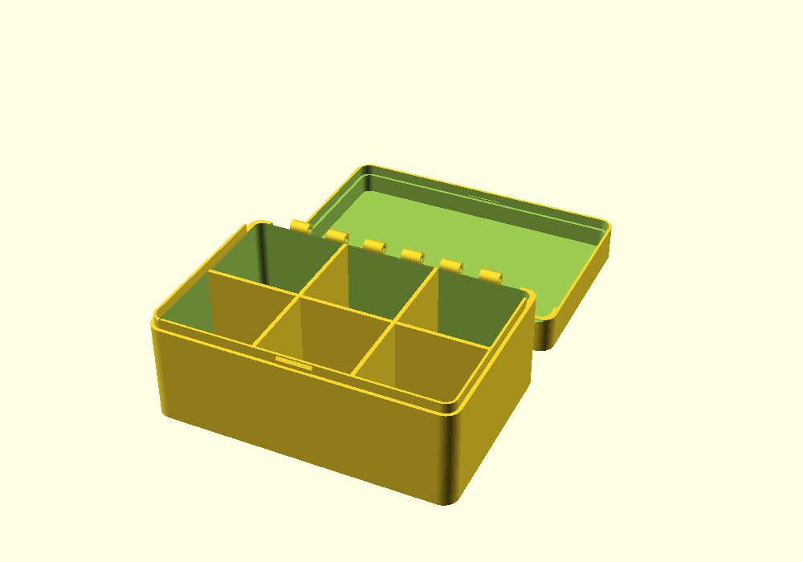
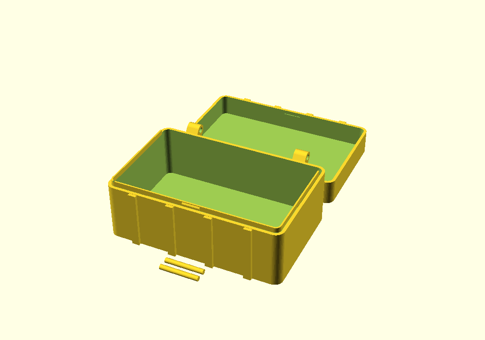
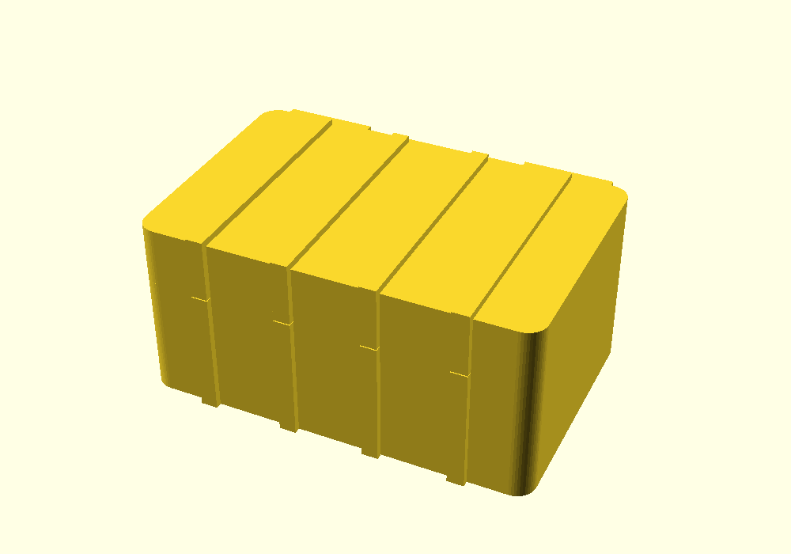

# OpenSCAD_case

Parametric case/box library, plain OpenSCAD, no external libraries beyond the
[OpenSCAD_hinge](https://github.com/morganp/OpenSCAD_hinge) dependency (auto-fetched by
[OpenSCAD-gui](../OpenSCAD-gui) via its `// @github:` tag). Loadable standalone in real
OpenSCAD and in the browser.

## hinged_box — two-tray hinged box with pinned hinges and a snap latch

A body tray and a lid tray joined by real pinned hinges across the back seam, with an
alignment lip on the body rim and a snap latch on the front. Two printed parts, no supports;
each part carries its own fused hinge leaf, and a pin dropped through the knuckles finishes
the assembly. Far more robust than a living/flex hinge, and the pin is replaceable if it
ever wears.

| Print pose | Closed (assembly check) |
|---|---|
|  |  |

**[▶ Open in SCAD Studio](https://lizard-spock.co.uk/openscad-gui/?github=morganp/OpenSCAD_case/examples/hinged_box_demo.scad)** —
view this example in the browser, no install; the library (and its hinge dependency) load automatically.

```openscad
include <case_library.scad>

hinged_box(
    length = 120, width = 80, height = 40,
    lid_depth = 15,
    div_x = 2, div_y = 1,
    lid_text = "TOOLS"
);
```

### Hinge types

| `hinge_type` | Hinge | Pin |
|---|---|---|
| `"piano"` (default) | One continuous knuckle hinge across the back seam — even load spread, sturdiest | 1.75mm filament offcut |
| `"knuckle"` | `hinge_count` discrete knuckle hinges — lighter, classic look | 1.75mm filament offcut |
| `"crate"` | Chunky raised-lug crate hinges, lid opens past 180° — the rugged/ammo-box look | 4mm rod, or the printed pins emitted beside the parts |

The hinge geometry itself comes from
[OpenSCAD_hinge](https://github.com/morganp/OpenSCAD_hinge)'s `piano_hinge` /
`knuckle_hinge` / `crate_hinge`, emitted one leaf at a time (`parts="leaf1"/"leaf2"`) so
each printed part gets its own fused leaf.

### Rugged box variation

Set `hinge_type="crate"` and `ribs > 0` for the rugged-crate look: vertical ribs run up the
front wall, across the seam, and over the lid top; crate hinges hang on the back.

```openscad
hinged_box(
    length = 140, width = 90, height = 45, lid_depth = 20,
    hinge_type = "crate", hinge_count = 2, hinge_len = 32,
    ribs = 4
);
```

| Print pose | Closed |
|---|---|
|  |  |

**[▶ Open in SCAD Studio](https://lizard-spock.co.uk/openscad-gui/?github=morganp/OpenSCAD_case/examples/rugged_box_demo.scad)**

### How it prints and assembles

`pose="print"` (default) lays both parts flat on the bed: the body upright, the lid beyond
it in +Y opening up. The hinge leaves are recessed flush into the back walls (leaf thickness
is clamped below the wall, leaf width below the lid depth), so only the barrel sits proud of
the back face; the mating rims are notched around each other's knuckles, and a half-round
groove along the seam gives the pin a clear entry path. Print, then mate the hinge knuckles
and slide the pin in along the seam groove — a length of 1.75mm filament for piano/knuckle
(melt-mushroom the ends to captivate it), a 4mm rod or the printed pins for crate. The lid
then folds over; the lip registers it and the front ridge snaps into the groove inside the
lid wall.

`pose="closed"` renders the assembled box (pins shown in place) for checking fit,
proportions, and lid text before printing.

Print settings (slicer profile, not module parameters): 0.2mm layer height, 3–4 walls, PLA
or PETG. The small piano/knuckle barrel overhangs on the back faces print fine without
supports; the chunky crate lugs stick out further and may want supports or tuned bridging.

| Parameter | Default | Meaning |
|---|---|---|
| `length` | 120 | Outer footprint, X |
| `width` | 80 | Outer footprint, Y |
| `height` | 40 | Body tray **outer** height, bed to seam, includes the floor wall |
| `lid_depth` | 15 | Lid tray **outer** height above the seam, includes the lid top wall |
| `wall` | 2.4 | Wall thickness |
| `corner_r` | 6 | Outer corner rounding radius |
| `div_x` | 0 | Internal dividers splitting `length` (walls run along Y) |
| `div_y` | 0 | Internal dividers splitting `width` (walls run along X) |
| `div_thickness` | 1.6 | Divider wall thickness |
| `hinge_type` | "piano" | `"piano"` / `"knuckle"` / `"crate"` |
| `hinge_count` | 2 | Number of discrete hinges (knuckle/crate) |
| `hinge_len` | 30 | Leaf length along X per discrete hinge (knuckle/crate) |
| `hinge_margin` | 8 | Hinge inset from each end along X |
| `knuckle_od` | 0 (auto) | Piano/knuckle barrel OD; auto = `max(5, 2*wall)` |
| `pin_d` | 0 (auto) | Hinge pin diameter; auto = 1.75 (filament), 4 for crate |
| `pin_clearance` | 0.25 | Radial pin-to-bore clearance |
| `leaf_thickness` | 2 | Hinge leaf/strap thickness, recessed into the back walls (clamped to `wall - 0.4`) |
| `lip_h` | 4 | Alignment lip height above the seam (clamped to fit inside the lid cavity: `lid_depth - wall - lid_clearance`) |
| `lid_clearance` | 0.3 | Radial clearance between lip and lid inner wall |
| `latch_w` | 14 | Snap latch width, centered on the front |
| `latch_bump` | 0.8 | Snap ridge protrusion from the lip face |
| `ribs` | 0 | Rugged-look vertical ribs on the front wall and over the lid top |
| `rib_w` | 0 (auto) | Rib width; auto = `2.5*wall` |
| `rib_depth` | 0 (auto) | Rib protrusion; auto = `wall` |
| `lid_text` | "" | Text on the lid's outer top face |
| `lid_text_size` | 10 | Lid text size |
| `lid_text_depth` | 0.6 | Engrave/emboss depth |
| `lid_text_emboss` | false | true = raised text (prints face-down — prefer the default deboss on FDM) |
| `pose` | "print" | `"print"` = parts flat on the bed, `"closed"` = assembled preview |
| `fn` | 48 | Circle resolution |

**Dimensions are outer.** All four size parameters are external, walls included. The
`echo()` output reports the internal numbers at render time: internal footprint
`(length-2*wall) x (width-2*wall)`, body cavity depth `height-wall`, and closed
floor-to-lid clearance `height+lid_depth-2*wall`.

**Fit notes:** `lid_clearance`, `latch_bump`, and `pin_clearance` are best-effort starting
points, not tuned to a specific printer/material — check on a test print. Lid text sits on
the outer top face, which prints against the bed; the default debossed text prints fine
face-down, raised text does not. Ribs and lid text both occupy the lid top, so debossed text
carves through any ribs it crosses (stencil look) — drop one or the other if that's not
wanted.

## Regenerating previews

```sh
openscad -o renders/<name>.png        --imgsize=1000,700 --autocenter --viewall examples/<name>_demo.scad
openscad -o renders/<name>_closed.png --imgsize=1000,700 --autocenter --viewall -D 'pose="closed"' examples/<name>_demo.scad
```
